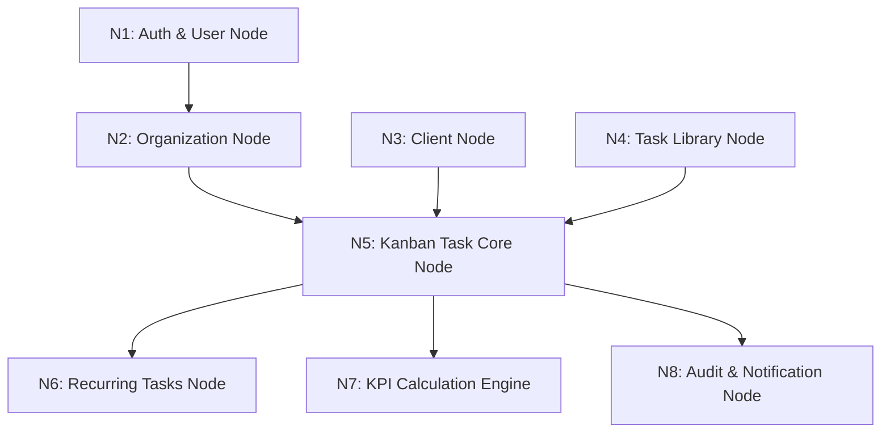

# 🗺️ Kanban KPI - Feature Nodes & Architecture Map

Document ini adalah **Feature Node Map** resmi untuk proyek **Kanban KPI** (Tax Consulting Task & KPI Platform). Document ini dibuat sebagai acuan utama untuk AI dan Developer agar penambahan fitur baru di masa mendatang dapat dieksekusi **lebih cepat, konsisten, dan efisien**.

---

## 1. System Architecture Overview

- **Framework:** Laravel 11 / 13 (PHP 8.3+)
- **Frontend / Reactivity:** TALL Stack (Tailwind CSS, Alpine.js + SortableJS, Livewire 3 SPA mode with `wire:navigate`)
- **Real-time WebSockets:** Laravel Reverb (`laravel/reverb`)
- **Role & Permission:** Spatie Laravel Permission (`spatie/laravel-permission`)
- **Activity Logging:** Spatie Activitylog (`spatie/laravel-activitylog`)
- **Design System:** Custom UI Genesis System (`design.md`) - **Bypass Filament UI**.

---

## 2. Core Feature Nodes (Map Node Domain)

### 📍 Node 1: Authentication & User Management (`N1_AUTH`)
- **Primary Models:** `App\Models\User`
- **Roles:** `director`, `manager`, `staff`
- **Key Attributes:** `base_point_rate` (Rupiah/point), `position_name`, `whatsapp_number`, `is_active`, `manager_id`
- **Livewire Components:**
  - `App\Livewire\Auth\Login` ([routes/web.php](file:///d:/laragon/www/kanban-kpi/routes/web.php#L20))
  - `App\Livewire\Staff\Index` ([routes/web.php](file:///d:/laragon/www/kanban-kpi/routes/web.php#L44))
- **Role Hierarchy & Data Visibility Scope:**
  - `Director`: Access ALL divisions, staff, logs, grade multipliers, full Kanban override.
  - `Manager`: Access own tasks & division staff tasks, approve/reject Kanban items, load monitoring.
  - `Staff`: Access assigned tasks ONLY, transition tasks from New -> In Progress -> Review.

---

### 📍 Node 2: Organization & Division Node (`N2_ORGANIZATION`)
- **Primary Models:** `App\Models\Division`, `manager_staff` (Pivot)
- **Relationships:** Division `hasMany` Users, Manager `belongsToMany` Staffs.
- **Livewire Components:**
  - `App\Livewire\Divisions\Index` ([routes/web.php](file:///d:/laragon/www/kanban-kpi/routes/web.php#L53))
  - `App\Livewire\Manager\LoadMonitoring` ([routes/web.php](file:///d:/laragon/www/kanban-kpi/routes/web.php#L39))

---

### 📍 Node 3: Client Management & Grade System (`N3_CLIENT`)
- **Primary Models:** `App\Models\Client`, `App\Models\GradeMultiplier`
- **Grades:** `A`, `B`, `C`, `D`, `E`, `F` (Multipliers for default difficulty points)
- **Livewire Components:**
  - `App\Livewire\Clients\Index` ([routes/web.php](file:///d:/laragon/www/kanban-kpi/routes/web.php#L38))
  - `App\Livewire\GradeMultipliers\Index` ([routes/web.php](file:///d:/laragon/www/kanban-kpi/routes/web.php#L54))

---

### 📍 Node 4: Task Reference Library / SOP (`N4_TASK_LIBRARY`)
- **Primary Models:** `App\Models\TaskReference`
- **Purpose:** Master SOP database containing default task titles, standard operating procedures, task types (Client / Internal), and difficulty points.
- **Livewire Components:**
  - `App\Livewire\TaskLibrary\Index` ([routes/web.php](file:///d:/laragon/www/kanban-kpi/routes/web.php#L37))
- **Integration Node:** Auto-fills task creation inputs in Kanban when a reference template is selected.

---

### 📍 Node 5: Kanban Task Core Engine (`N5_KANBAN_CORE`)
- **Primary Models:** `App\Models\Task`, `App\Models\TaskMessage`, `App\Models\MessageReadStatus`
- **Statuses:** `New` -> `In_Progress` -> `Review` -> `Revision` -> `Completed`
- **Livewire Components:**
  - `App\Livewire\Kanban\Board` ([routes/web.php](file:///d:/laragon/www/kanban-kpi/routes/web.php#L32))
- **Key Business Logic:**
  - **Drag & Drop Reordering:** SortableJS + Alpine.js.
  - **Undo Mechanism:** `previous_status` column restored within 10-second toast window.
  - **Task Takeover System:**
    - Trigger: Incomplete task past deadline + 24 hours OR Manager manual takeover.
    - Hero Bonus: Completing user receives `difficulty_points * 1.2` (+20%).
    - Penalty: Original PIC receives `-50%` difficulty points deduction (`difficulty_points * 0.5`).
  - **Per-Task Slide-over Chat:** Live updates, attachments, read status sync via `message_read_statuses`.

---

### 📍 Node 6: Recurring Tasks Engine (`N6_RECURRING`)
- **Primary Models:** `App\Models\RecurringTask`
- **Frequencies:** `Daily`, `Weekly`, `Monthly`, `Yearly`
- **Artisan Command:** `php artisan recurring:process`
- **Cron Endpoint:** `GET /cron/process-recurring-tasks` ([routes/web.php](file:///d:/laragon/www/kanban-kpi/routes/web.php#L59))
- **Livewire Component:**
  - `App\Livewire\RecurringTasks\Index` ([routes/web.php](file:///d:/laragon/www/kanban-kpi/routes/web.php#L33))

---

### 📍 Node 7: KPI Calculation Engine (`N7_KPI_ENGINE`)
- **Primary Models:** `App\Models\KpiReport`
- **Calculation Formula:**
  - **S_prod (Productivity Score):** `(Completed Points / Total Assigned Points) * 100`
  - **S_qual (Quality Score):** `100 - (Revision Count * 15)`
  - **S_time (Timeliness Score):** Deadline vs `completed_at` (-10 points per day late)
  - **NAK (Final KPI Score 0-100):** `(S_prod * 0.4) + (S_qual * 0.3) + (S_time * 0.3)`
  - **Total Incentive:** `NAK * Total Points * base_point_rate`
- **Livewire Component:**
  - `App\Livewire\KpiReports\Index` ([routes/web.php](file:///d:/laragon/www/kanban-kpi/routes/web.php#L48))

---

### 📍 Node 8: Audit Log & Notification System (`N8_AUDIT_NOTIF`)
- **Primary Models:** `Spatie\Activitylog\Models\Activity`, `App\Models\ActivityReadStatus`
- **Livewire Components:**
  - `App\Livewire\ActivityLogs\Index` ([routes/web.php](file:///d:/laragon/www/kanban-kpi/routes/web.php#L52))
  - `App\Livewire\ActivityNotifications` (Header Notification Dropdown)

---

### 📍 Node 9: Subjective Evaluation Engine (`N9_SUBJECTIVE_EVAL`)
- **Primary Models:** `App\Models\EvalCategory`, `App\Models\EvalCriterion`, `App\Models\EvalIndicator`, `App\Models\SubjectiveEvaluation`, `App\Models\SubjectiveEvaluationScore`
- **Artisan Generator Command:** `php artisan subjective-eval:generate`
- **Scheduled Cron:** Monthly on the 25th (`routes/console.php`) & `GET /cron/generate-subjective-evaluations`
- **Livewire Components:**
  - `App\Livewire\SubjectiveEvaluations\Index` ([routes/web.php](file:///d:/laragon/www/kanban-kpi/routes/web.php#L47))
  - `App\Livewire\SubjectiveEvaluations\Form` ([routes/web.php](file:///d:/laragon/www/kanban-kpi/routes/web.php#L48))
  - `App\Livewire\SubjectiveEvaluations\Indicators` ([routes/web.php](file:///d:/laragon/www/kanban-kpi/routes/web.php#L39))
- **Key Business Logic:**
  - Competency categories (RAFA: Rispek, Antusias, Fatanah, Amanah).
  - Side-by-side comparison table: *Self Assessment* (Staff) vs *Penilaian Atasan* (Manager/Director).
  - Automatic average calculation & recurring monthly generation service.

---

### 📍 Node 10: WhatsApp Gateway Engine (`N10_WA_GATEWAY`)
- **Primary Models & Services:** `App\Models\Setting`, `App\Services\WhatsAppService`
- **Gateway Engine Integration:** `aldinokemal/go-whatsapp-web-multidevice` (v9.0.0 REST API)
- **Livewire Settings Component:**
  - `App\Livewire\Settings\WhatsAppGateway` ([routes/web.php](file:///d:/laragon/www/kanban-kpi/routes/web.php#L60))
- **Key Business Logic:**
  - Restricted exclusively to `role:director`.
  - Dynamic key-value configuration (`settings` table) overriding `.env` defaults.
  - Server connection Health Check & Live Status.
  - Dual Reconnect Options: **Scan QR Code** & **8-Digit Pairing Code**.
  - Test Message Delivery Engine with automatic Indonesian phone number formatting (`08xx` $\rightarrow$ `628xx`).

---

## 3. UI/UX Design System Rules (Genesis Specs)

Setiap penambahan komponen UI baru WAJIB mengikuti token UI Genesis (`design.md`):

| Token UI | Hex / Value | Standard Usage |
| :--- | :--- | :--- |
| **Primary** | `#6366F1` | CTA utama, link, active states, focus ring |
| **Primary Hover** | `#4F46E5` | Hover state tombol utama |
| **Secondary** | `#20970B` | Exclusively for brand highlights |
| **Background** | `#FAFAFA` | Page body background |
| **Surface** | `#FFFFFF` | Cards, panels, modals |
| **Text Primary** | `#0A0A0A` | Headings & main label |
| **Text Secondary** | `#6B6B6B` | Description & metadata |
| **Border** | `#E8E8EC` | Input & Card borders |
| **Success** | `#10B981` | Status completed / success |
| **Warning** | `#F59E0B` | Status revision / warning |
| **Error** | `#EF4444` | Destructive action / late status |

- **Display Typography:** General Sans (Headings)
- **Body Typography:** DM Sans (Body UI)
- **Code Typography:** JetBrains Mono
- **Border Radius Standards:** `4px` (Tags/Chips), `6px` (Buttons/Inputs), `8px` (Dropdowns/Panels), `12px` (Cards/Modals), `9999px` (Pill badges/Avatars).

---

## 4. Developer Playbook: Blueprint Penambahan Fitur Baru

Saat menambahkan fitur baru, ikuti checklist node ini agar eksekusi instan dan bebas error:

### 🚀 Standard Workflow Node (Contoh: Menambahkan Sub-Fitur Baru)
1. **Identify Target Node:** Tentukan fitur masuk ke Node mana (`N1` s/d `N8`).
2. **Database Migration:** 
   - Gunakan `foreignId()->constrained()` untuk FK.
   - Tambahkan SoftDeletes jika relevan.
3. **Model & Spatie Activitylog:**
   - Define `$fillable`, `$casts`, dan Relasi Eloquent.
   - Inject `LogsActivity` trait jika aksi model perlu dicatat di Audit Log (`N8`).
4. **Livewire Component & View:**
   - Gunakan SPA Mode (`wire:navigate`).
   - Terapkan scope visibilitas role (`director` / `manager` / `staff`).
   - Terapkan token Genesis Design (Tailwind colors & General Sans font).
5. **Route Mapping:**
   - Register route di `routes/web.php` sesuai middleware role yang tepat.

---

Dengan acuan Feature Node Map ini, setiap request penambahan fitur baru dari User akan dapat dipetakan langsung ke Node terkait dan diselesaikan secara presisi!
